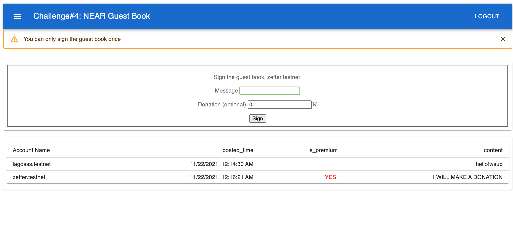

#introduction  

1.contrac name:guest-book.lagosss.testnet   
written by Rust. Deployment tx address:  
https://explorer.testnet.near.org/transactions/2j4nCqr1sjwNeG9Q862x12D23sbuADq1V7miFHcCWYj7 

2.frontend: React and MUI components   
website:  
https://vg2sl28edsbqsqbjgp9g7s16cmrfi35k5r8v5hidg4vk4b1anhvvnhg.siasky.net/  

3.and what's new?  
1) contract is written by Rust, message data is saved in a UnorderedMap.  
2) Restrict a user to only sign the guest book once, both contract and frontend is guaranteed.  
3) the frontend has been styling via Material-UI.  
4) contract supports pagination
5) anyone who made a donation will be displayed as a "PREMIUM YES!"